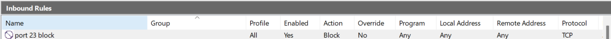
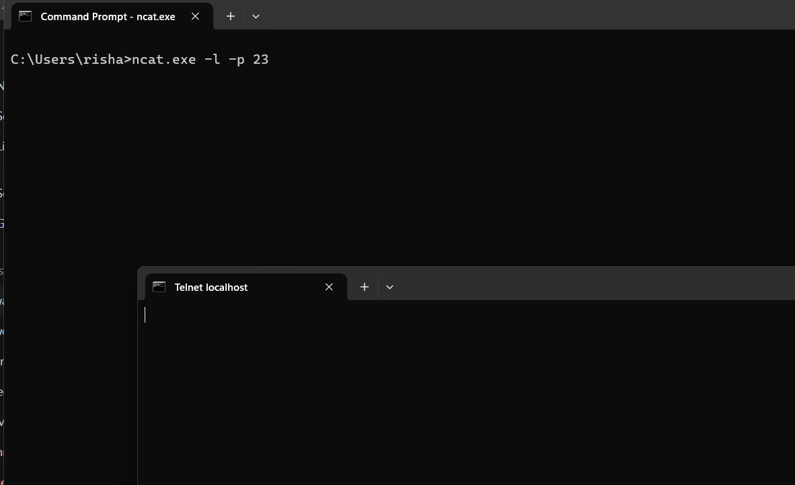
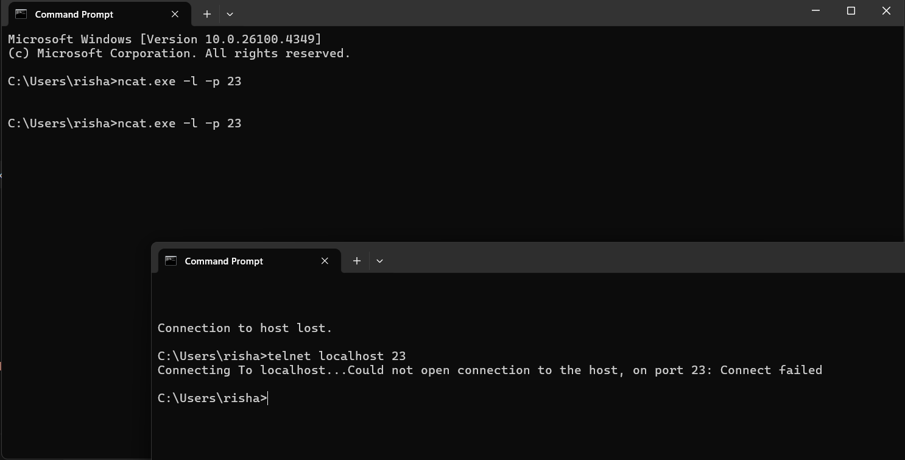

# 🔐 Firewall Configuration Task – Detailed Report

## 🔸 Step 1: Open Firewall Configuration Tool
Opened **Windows Defender Firewall with Advanced Security** via Start Menu.

## 🔸 Step 2: List Current Rules
Navigated to **Inbound Rules** to view existing ports and rules.

## 🔸 Step 3: Add a Rule to Block Port 23 
- Created a new inbound rule
- Selected **TCP**, **Specific Port: 23**
- Selected **Block the connection**
- Applied to **Domain, Private, and Public**



## 🔸 Step 4: Test the Rule
- Started a listener using:
  ```cmd
  ncat.exe -l -p 23

- In a new tab run the following command:
  ```cmd
  telnet localhost 23



##  ✅ Result:
Blank screen — connection successful (indicates port 23 was open and accessible).

## 🔸Step 5: Remove the Test Rule
Deleted the Block Telnet 23 rule from Inbound Rules to restore the original state.

Now repeat Step-4



❌ Result:
Could not open connection to the host, on port 23: Connect failed

## Summary: How Firewalls Filter Traffic
A firewall filters network traffic by allowing or blocking data packets based on a set of security rules. It works at different layers of the OSI model and is used to:

- Prevent unauthorized access

- Restrict traffic based on:

- Port numbers (e.g., block port 23 for Telnet)

- Protocols (TCP/UDP)

- IP addresses

- Traffic direction (inbound/outbound)


